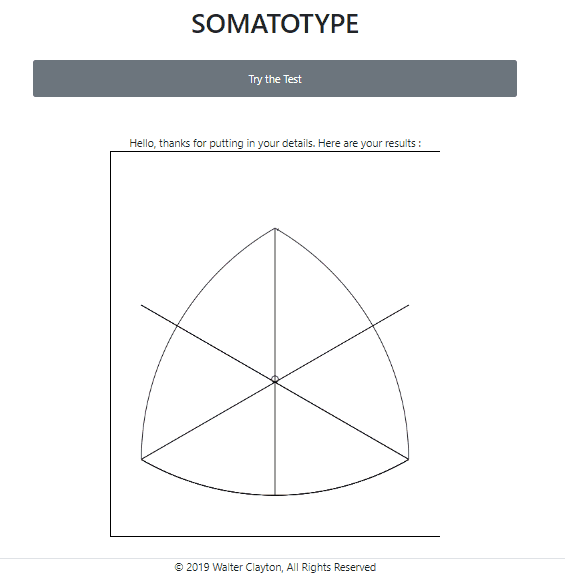

# SOMATOTYPE

I built this page to practice my frontend and Vanilla Javascript skills. 

This is a page that allows users to know their somatotype. 

Users put in their measurements, and the canvas outputs their results on the graph. 

The biggest difficulty was the graph. It required some knowledge in trigonometry and mathematics. 

Click here: [Demo](https://walter-clayton.github.io/somatotype/)

## Features

* User input
* Graph ouput
* Information (why, what, how, references, examples)
* Comparisons in the examples
* Amazon Affiliate links
* Responsive

## Things to improve

* Customised Comparisons 
* Share results via email

## BONUSES

* 3D View of graph

## Built with

* HTML5
* CSS3
* BOOTSTRAP4
* Vanilla JavaScript

## Author

* **Walter Clayton** : [github profil](https://github.com/walter-clayton)

* **LinkedIn account** : [LinkedIn](https://www.linkedin.com/in/walter-clayton-2b50b4191/)

## Copyright

&copy; 2019 Walter Clayton, All Rights Reserved

